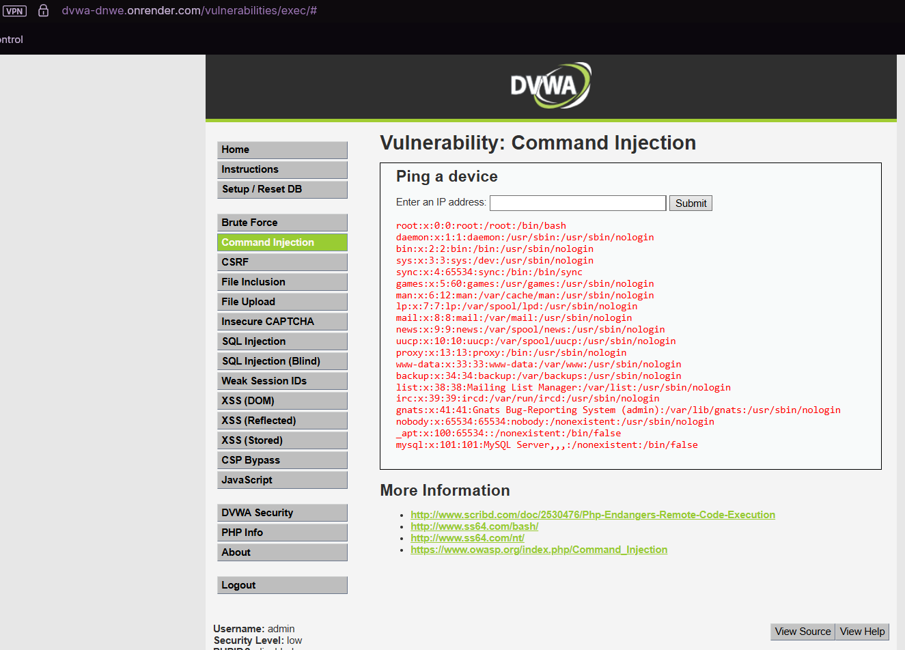

# Inyección de Comandos — Vulnerabilidad: Command Injection

## 1. Evidencia del ataque

**Entorno:** DVWA, nivel de seguridad **Low**, módulo *Command Injection*.

**Payload utilizado:**

```bash
127.0.0.1; cat /etc/passwd
```

**Resultado:** la aplicación ejecutó el ping a `127.0.0.1` y, **además**, mostró el contenido completo del archivo `/etc/passwd` del servidor, exponiendo las cuentas de sistema (root, daemon, bin, sys, mail, mysql, www-data, entre otras).



## 2. Por qué funciona la vulnerabilidad

La aplicación toma el valor ingresado en el campo "IP address" y lo concatena directamente dentro de un comando del sistema operativo que ejecuta en el servidor, típicamente algo como:

```php
shell_exec("ping -c 3 " . $_POST['ip']);
```

El carácter `;` en sistemas tipo Unix/Linux funciona como **separador de comandos**: le indica a la shell "ejecuta esto, y luego ejecuta lo que sigue como un comando completamente nuevo e independiente". Al ingresar `127.0.0.1; cat /etc/passwd`, el servidor en realidad ejecuta **dos comandos**:

```bash
ping -c 3 127.0.0.1
cat /etc/passwd
```

Como la aplicación no valida que el input sea exclusivamente una dirección IP (por ejemplo, mediante una expresión regular estricta), ni usa una API segura para ejecutar el ping (en vez de invocar directamente la shell), el atacante puede ejecutar **cualquier comando arbitrario** con los mismos permisos que el proceso del servidor web.

En un escenario real contra la infraestructura de AFP Horizonte, esto no se limitaría a leer `/etc/passwd`: un atacante podría leer archivos de configuración con credenciales de base de datos, instalar puertas traseras (backdoors), exfiltrar la base completa de afiliados directamente desde el sistema de archivos, o pivotar hacia otros sistemas internos de la red corporativa.

## 3. Puntaje y severidad CVSS


> Indicación: este suele ser el más severo de los tres ataques, porque otorga ejecución de comandos a nivel de **sistema operativo** (no solo de base de datos como SQLi). Generalmente se evalúa con AV:N, AC:L, PR:N, UI:N, y C/I/A todos en High, dado que compromete completamente confidencialidad, integridad y disponibilidad del servidor.

Cálculo realizado con la calculadora oficial: https://www.first.org/cvss/calculator/3.1

**Vector CVSS 3.1:** `AV:N/AC:L/PR:N/UI:N/S:U/C:H/I:H/A:H`
**Puntaje base:** **9.8 / 10 — Severidad Crítica**

### Justificación de cada métrica

**Vector de ataque (AV) = Red (N)**
El payload se envía a través del formulario web "Ping a device", accesible remotamente vía red — no requiere acceso físico ni estar en la misma red local que el servidor.

**Complejidad de ataque (AC) = Bajo (L)**
Basta con un separador de comandos (`;`) seguido del comando deseado (`cat /etc/passwd`). No hay condiciones especiales que vencer ni timing que calcular.

**Privilegios requeridos (PR) = Ninguno (N)**
No se necesita ninguna cuenta especial ni nivel de acceso adicional dentro de la aplicación para inyectar el comando en el campo de IP.

**Interacción de usuario (UI) = Ninguno (N)**
El propio atacante envía el payload directamente y obtiene el resultado de inmediato; no depende de que otra persona haga clic en nada.

**Alcance (S) = Sin cambios (U)**
El impacto se mantiene dentro del mismo servidor/componente que ejecuta la aplicación vulnerable, sin necesidad de "saltar" a otro sistema con autoridad distinta para que el daño sea severo.

**Confidencialidad (C) = Alto (H)**
Quedó demostrado: el ataque expuso el contenido completo de `/etc/passwd`, un archivo del sistema operativo. La misma técnica permite leer cualquier archivo accesible para el usuario del servidor web (configuraciones, credenciales, código fuente).

**Integridad (I) = Alto (H)**
La ejecución de comandos arbitrarios permite no solo leer, sino también **crear, modificar o eliminar archivos** del servidor (por ejemplo, instalar una puerta trasera o alterar el código de la aplicación).

**Disponibilidad (A) = Alto (H)**
Un atacante podría ejecutar comandos que detengan procesos críticos, agoten recursos del servidor (CPU, memoria, disco) o directamente apaguen el servicio — a diferencia de SQLi y XSS, aquí se tiene control total a nivel de sistema operativo, lo que hace posible afectar la disponibilidad del servicio completo.

## 4. Política de prevención (3.1.4)

- **Evitar invocar la shell del sistema operativo** desde código de aplicación; usar siempre APIs/librerías nativas del lenguaje para tareas como ping, en vez de `shell_exec`, `system`, `exec`, etc.
- **Validación estricta de formato de entrada** (ej. expresión regular que solo acepte el formato exacto de una dirección IPv4/IPv6), rechazando cualquier carácter especial de shell (`;`, `|`, `&`, `` ` ``, `$()`).
- **Principio de mínimo privilegio** para el usuario del sistema operativo que ejecuta el servidor web, sin permisos de lectura sobre archivos sensibles del sistema ni de otras aplicaciones.

## 5. Control de mitigación (3.1.5)

- **Contenedores o sandboxing** del proceso de la aplicación web, limitando el daño aunque se logre ejecutar un comando arbitrario.
- **Web Application Firewall (WAF)** con reglas que detecten metacaracteres de shell (`;`, `|`, `&&`) en campos que esperan solo direcciones IP.
- **Monitoreo de integridad de archivos (FIM)** y alertas ante accesos no autorizados a archivos críticos del sistema.
- **Segmentación de red**, separando el servidor web del servidor de base de datos y de otros sistemas internos, para limitar el movimiento lateral si el servidor web es comprometido.