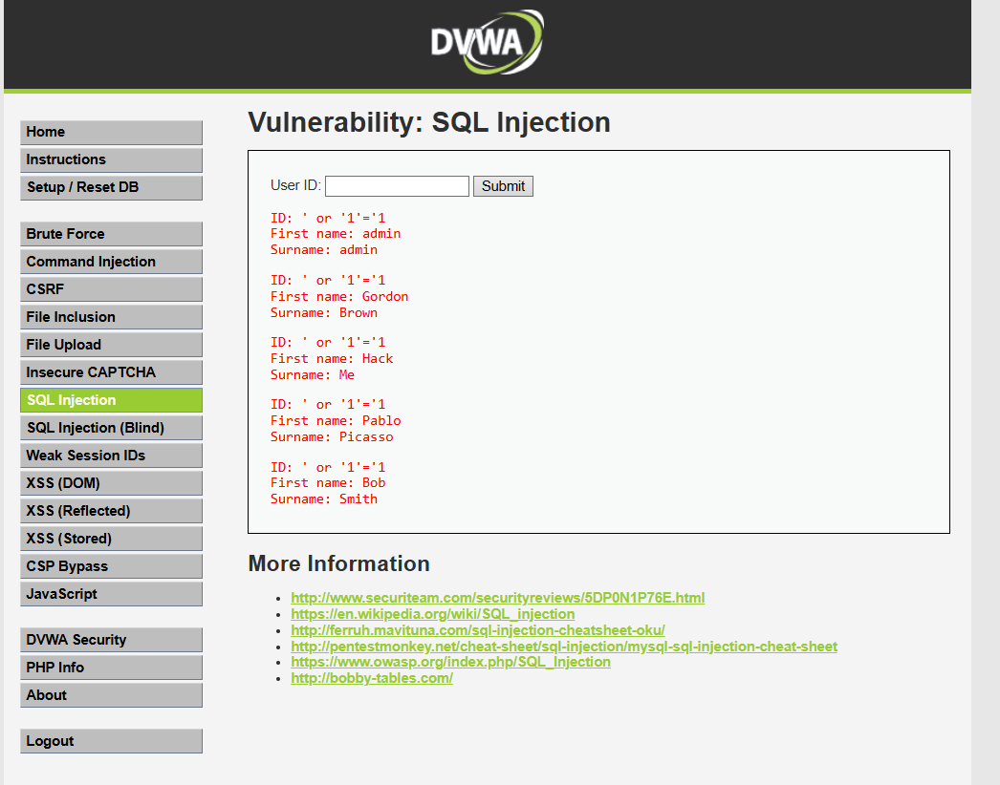

# Inyección SQL — Vulnerabilidad: SQL Injection

## 1. Evidencia del ataque

**Entorno:** DVWA, nivel de seguridad **Low**, módulo *SQL Injection*.

**Payload utilizado:**

```sql
' OR '1'='1
```

**Resultado:** en vez de devolver la información de un único usuario (según el "User ID" ingresado), la aplicación devolvió **el listado completo de la tabla de usuarios**: admin, Gordon Brown, Hack Me, Pablo Picasso y Bob Smith, incluyendo nombre y apellido de cada uno.



## 2. Por qué funciona la vulnerabilidad

El formulario construye la consulta SQL concatenando directamente el valor ingresado por el usuario, sin validarlo ni separarlo del código SQL. La consulta en el servidor es similar a:

```sql
SELECT first_name, last_name FROM users WHERE user_id = '$id';
```

Al ingresar `' OR '1'='1`, la consulta resultante queda:

```sql
SELECT first_name, last_name FROM users WHERE user_id = '' OR '1'='1';
```

La condición `'1'='1'` es **siempre verdadera**, por lo que la cláusula `WHERE` deja de filtrar por un usuario específico y la consulta devuelve **todas las filas** de la tabla `users`. Esto se conoce como **inyección SQL clásica (in-band)**: el atacante manipula directamente la lógica de la consulta porque la aplicación no usa **consultas parametrizadas** ni sanitiza la entrada.

En un escenario real contra el portal de AFP Horizonte, esta misma técnica podría usarse para extraer RUT, saldos de cuenta individual, historial de cotizaciones, o incluso para modificar/eliminar registros, según los permisos de la cuenta de base de datos usada por la aplicación.

## 3. Puntaje y severidad CVSS


## 4. Política de prevención (3.1.4)

- **Uso obligatorio de consultas parametrizadas / prepared statements** en todo acceso a base de datos, prohibiendo la concatenación directa de entradas del usuario en sentencias SQL.
- **Principio de mínimo privilegio** en la cuenta de base de datos que usa la aplicación web (sin permisos de DROP/ALTER, y limitando UPDATE/DELETE a lo estrictamente necesario).
- **Revisión de código (code review) obligatoria** antes de desplegar cambios que toquen consultas a la base de datos de afiliados.

## 5. Control de mitigación (3.1.5)

- **Web Application Firewall (WAF)** con reglas específicas de detección de patrones de inyección SQL (ej. `OR 1=1`, comillas no escapadas).
- **Validación y sanitización de entradas** en el backend (whitelisting de formato esperado, ej. solo números para un campo de ID).
- **Monitoreo y alertas** sobre consultas anómalas a la base de datos (ej. consultas que devuelven un volumen de filas anormalmente alto para el contexto).
- **Cifrado de datos sensibles en reposo** (RUT, saldos, historial de cotizaciones), para que incluso si la inyección ocurre, el daño esté acotado.