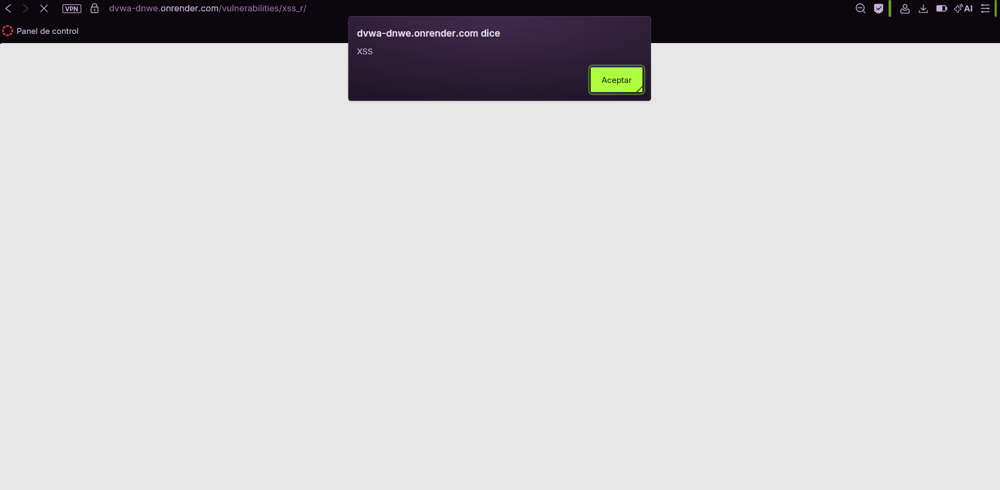

# XSS Reflejado — Vulnerabilidad: XSS (Reflected)

## 1. Evidencia del ataque

**Entorno:** DVWA, nivel de seguridad **Low**, módulo *XSS (Reflected)*.

**Payload utilizado:**

```html
<script>alert('XSS')</script>
```

**Resultado:** al enviar el formulario, el navegador ejecutó el script inyectado y mostró un cuadro de alerta del sitio (`dvwa-dnwe.onrender.com dice: XSS`), en vez de simplemente mostrar el texto ingresado.



## 2. Por qué funciona la vulnerabilidad

El formulario toma el valor ingresado por el usuario (en el campo "name") y lo inserta directamente en el HTML de la página de respuesta, sin **escapar** los caracteres especiales (`<`, `>`) ni validar el contenido. La página construye algo similar a:

```html
<p>Hello <?php echo $_GET['name']; ?></p>
```

Al ingresar `<script>alert('XSS')</script>`, el HTML resultante queda:

```html
<p>Hello <script>alert('XSS')</script></p>
```

El navegador interpreta literalmente la etiqueta `<script>` como código ejecutable, no como texto. Esto se llama **XSS Reflejado** porque el payload viaja en la propia solicitud (por ejemplo, en la URL o un parámetro de formulario) y el servidor lo "refleja" de vuelta en la respuesta sin sanitizarlo — no queda almacenado en el servidor (a diferencia del XSS Almacenado).

En un escenario real contra el portal de AFP Horizonte, este mismo mecanismo podría usarse para robar la **cookie de sesión** de un afiliado (con `document.cookie`), redirigirlo a un sitio falso que imite el portal, o capturar credenciales mediante un formulario inyectado — todo ejecutándose con la identidad y permisos de la víctima real.

## 3. Puntaje y severidad CVSS

Cálculo realizado con la calculadora oficial: https://www.first.org/cvss/calculator/3.1

**Vector CVSS 3.1:** `AV:N/AC:L/PR:N/UI:R/S:U/C:L/I:L/A:N`
**Puntaje base:** **6.1 / 10 — Severidad Media**

### Justificación de cada métrica

**Vector de ataque (AV) = Red (N)**
El ataque se entrega a través de una URL o formulario web accesible por red — no requiere acceso físico ni estar en la misma red local que el servidor.

**Complejidad de ataque (AC) = Bajo (L)**
El payload es una sola etiqueta simple (`<script>alert('XSS')</script>`), sin condiciones especiales ni necesidad de evadir mecanismos adicionales para que se ejecute.

**Privilegios requeridos (PR) = Ninguno (N)**
No se necesita estar autenticado ni tener una cuenta especial para inyectar el payload en el parámetro reflejado.

**Interacción de usuario (UI) = Requerido (R)**
A diferencia de SQLi, aquí el ataque solo se completa si la **víctima** abre el enlace o visita la página que contiene el payload reflejado — el atacante no puede ejecutarlo "sobre sí mismo" para afectar a otra persona; necesita que la víctima haga ese clic.

**Alcance (S) = Sin cambios (U)**
El código inyectado se ejecuta dentro del contexto del mismo sitio vulnerable, sin escalar a otro componente con privilegios distintos.

**Confidencialidad (C) = Bajo (L)**
El script puede leer y exfiltrar información visible en la página o la cookie de sesión de la víctima, pero no otorga acceso directo y masivo a una base de datos completa como en SQLi.

**Integridad (I) = Bajo (L)**
Permite alterar lo que la víctima ve en su navegador (defacement, formularios falsos de phishing), pero no modifica datos persistentes en el servidor.

**Disponibilidad (A) = Ninguno (N)**
No afecta la disponibilidad del servicio para otros usuarios; el impacto se limita al navegador de la víctima que ejecuta el script.

## 4. Política de prevención (3.1.4)

- **Escapado de salida (output encoding)** obligatorio en todo dato proveniente del usuario antes de insertarlo en el HTML (convertir `<`, `>`, `"`, `'` a sus entidades HTML).
- **Content Security Policy (CSP)** que restrinja la ejecución de scripts inline y solo permita scripts desde orígenes confiables.
- **Validación de entrada** en el backend, rechazando o filtrando caracteres no esperados en campos de texto simple (como un nombre).

## 5. Control de mitigación (3.1.5)

- **Cookies de sesión con flags `HttpOnly` y `Secure`**, para que aunque un script malicioso se ejecute, no pueda leer ni robar la cookie de sesión vía JavaScript.
- **Web Application Firewall (WAF)** con reglas de detección de patrones XSS (etiquetas `<script>`, atributos `onerror`, `onload`, etc.).
- **Monitoreo de solicitudes con payloads sospechosos** (presencia de `<script>`, `javascript:`, codificaciones inusuales) en los logs del servidor.
- **Capacitación a desarrolladores** sobre uso correcto de librerías de templating que escapan por defecto (en vez de insertar HTML "crudo").